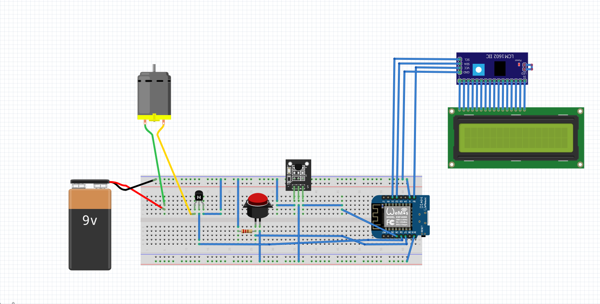
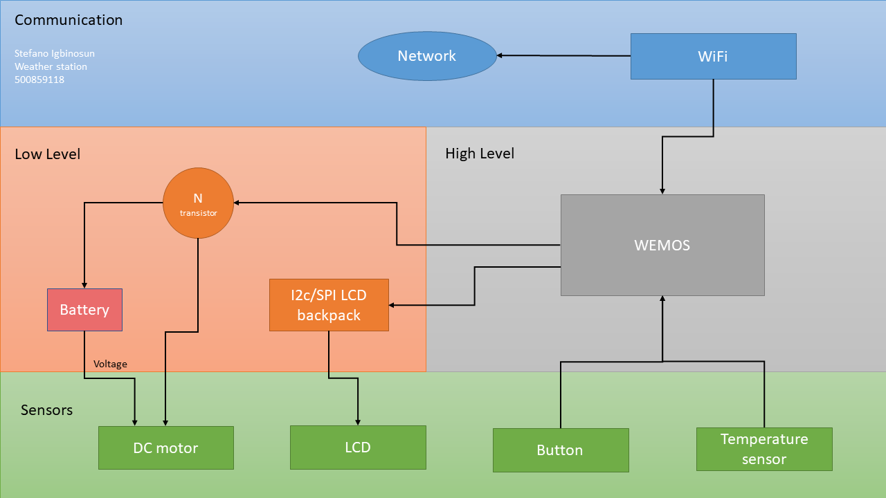
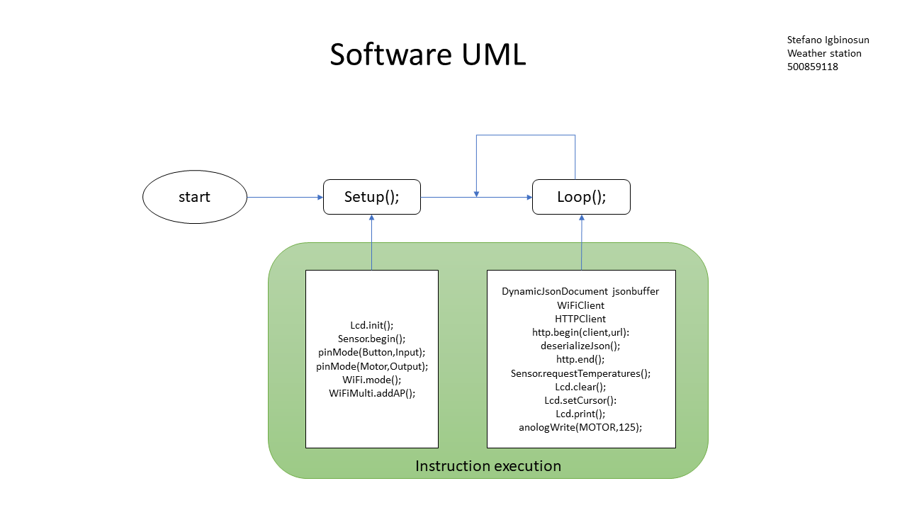
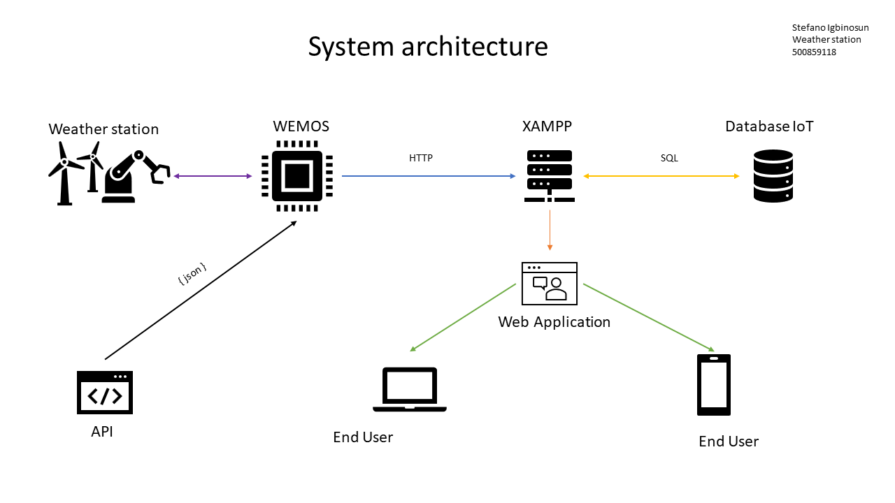

# Blueprint technical Documentation

## Wiring diagram 


## Bill of materials


|#| Part number  | Manufacturer  | Name    | Description                       | Quantity  | Cost   | url                                                                                                                                                                                                    |
|-|:------------:|:-------------:|:-------:|:---------------------------------:|:---------:|:------:| ------------------------------------------------------------------------------------------------------------------------------------------------------------------------------------------------------:|
|1|KY-001        | Keyes         | DS18B20 | Temperatuur Sensor Module DS18B20 |  1X       | € 2,99 |   |
|2|162LCD        |               | LCD     | LCD Display 16*2 characters       |  1x	 | € 4,00 |                                                                                 |
|3|              |               | Wemos   | ESP8266 D1 Mini Pro		       |  1x       | € 9,99 |      |
|4|              |               | DC      | DC motor                          |  1x       | € 1,25 |                                                                                             |
|5|              | Duracell      | Procell | Duracell Procell 9V Batterij      |  1x       | € 1,75 |                                                                                                         |
|6|000512        | 9V-T-HARD     | Clip    | 9V Batterij clip                  |  1x       | € 0,50 |                                                                             |
|7|000318        |               | resistor| 220Ω weerstand                    |  1x       | € 0,05 |  )                                                                        |
|8|              | Fairchild     | BC547   | BC547 Transistor                  |  1x       | € 0,11 |                                                                                                                              |
|9|HE0153-001    |               | I2C     | I2C LCD interface voor 16×2       |  1x       | € 1,95 |                                                                                                          |
|*|HE0129-910    |               | button  | Push button                       |  1x       | € 0,20 |                                   |
                                                                 

## Hardware architecture Overview


## UML


## API documentation 

Used API-endpoint


Only the current weather data in the compact parameter:

```
GET http://api.iot.hva-robots.nl/weather/Amsterdam/compact
```

Sample response:

```
{
  "success": true,
  "data": {
    "FeelsLikeC": "11",
    "FeelsLikeF": "53",
    "cloudcover": "25",
    "humidity": "94",
    "localObsDateTime": "2021-09-22 08:53 AM",
    "observation_time": "06:53 AM",
    "precipInches": "0.0",
    "precipMM": "0.0",
    "pressure": "1028",
    "pressureInches": "30",
    "temp_C": "12",
    "temp_F": "54",
    "uvIndex": "1",
    "visibility": "9",
    "visibilityMiles": "5",
    "weatherCode": "116",
    "weatherDesc": [
      {
        "value": "Partly cloudy"
      }
    ],
    "weatherIconUrl": [
      {
        "value": ""
      }
    ],
    "winddir16Point": "SW",
    "winddirDegree": "220",
    "windspeedKmph": "15",
    "windspeedMiles": "9"
  }
}
```

The request of data is the equivalent to a regular call to create a post above:

| Field | Type   | Description                                                                                                    |
|:-----:|:------:| --------------------------------------------------------------------------------------------------------------:|
| API   | string | sends a formated string value between interfaces, values that are measurement of outdoor sensor of the weather |

The rules around publishing each request to this API must respect:

- This API is only use for creative goals and not for the purpose of making money.
- If the user is neither a writer nor an editor, the user is not allowed to create any posts in a publication.
- Don't use verbs in urls.

Possible Http code:

| Http code              | Description                                                                                                                                   |
|:----------------------:| ---------------------------------------------------------------------------------------------------------------------------------------------:|
| 307 Temporary Redirect | redirect status response code indicates that the resource requested has been temporarily moved to the URL given by the `Location` headers.    |
| 200 OK                 | success status response code indicates that the request has succeeded.                                                                        |
| 400 Bad Request        | response status code indicates that the server cannot or will not process the request due to something that is perceived to be a client error |


## System architecture 
