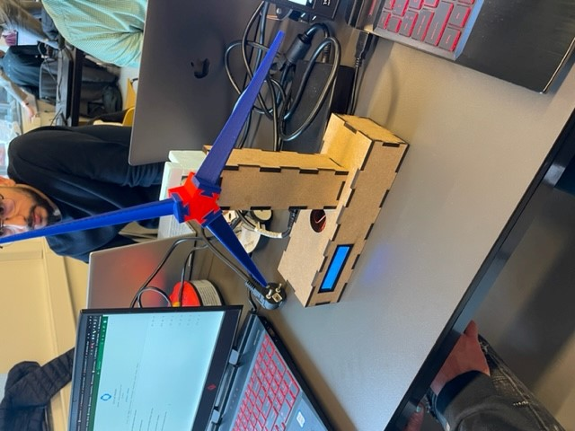
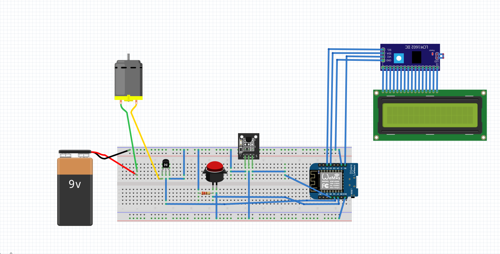

# Embedded device Technical Documentation

## Device description

The weather mill stations a device that will show you the outdoor temperature and the indoor temperature. 
The station can indicate wind power by spinning the mill depending on the wind speed outside. The station LCD can display more data of the weather with a push of a button. 
The weather mill station is meant to reduce the use of a smartphone. If the user wants to track the weather data. 
The web application of the weather mill station will show a graphic of the indoor/outdoor temperature history. 



## Code description


Here in this code I Initialise all the needed componenets for the loop:
```c++
void setup() {
  lcd.init();
  lcd.backlight();
  sensors.begin();
  pinMode(buttonPin, INPUT);
  pinMode(MOTOR, OUTPUT);
  Serial.begin(115200);
  // Serial.setDebugOutput(true);

  Serial.println();
  Serial.println();
  Serial.println();

  for (uint8_t t = 4; t > 0; t--) {
    Serial.printf("[SETUP] WAIT %d...\n", t);
    Serial.flush();
    delay(1000);
  }

  WiFi.mode(WIFI_STA);
  WiFiMulti.addAP("iotroam", "JSmdVaqTqt");
  //WiFiMulti.addAP("Ziggo9552054", "jm3Njqvqhhjf");

}

```

Here in this code the client session will be started to get data from the API:

```c++
    WiFiClient client;
    HTTPClient http;
    http.begin(client, "http://api.iot.hva-robots.nl/weather/Amsterdam/compact");//
    Serial.println(http.getString());
    int httpCode = http.GET();//
    Serial.println(httpCode);
    if (httpCode == HTTP_CODE_OK) { // HTTP_CODE_OK == 200
      String payload = http.getString();//
      Serial.println(payload);

      deserializeJson(jsonBuffer, payload);
   

    outdoorTemp = jsonBuffer["data"]["temp_C"].as<signed int>();
    cloudCover = jsonBuffer["data"]["cloudcover"].as<signed int>();
    windSpeed = jsonBuffer["data"]["windspeedKmph"].as<signed int>();
    //Serial.print("Outdoor temp in Amsterdam: ");
    Serial.println(outdoorTemp);
    http.end();

    } else {
      Serial.println("Unable to connect :( to api mats");
    }


```

Here in this code I start the temperature sensor and store the value in sensorValue.
button value will be stored in buttonState:

```c++
    Serial.print("[HTTP] begin...\n");
    sensors.requestTemperatures();
    double sensorValue = sensors.getTempCByIndex(0);
    buttonState = digitalRead(buttonPin);


```
Here in this code the lcd will display the data base on this code. With the button it will rewrite the data that is displayed on the lcd.

```c++
if (buttonState == HIGH) {
        lcd.clear();
        lcd.setCursor(12, 0);
        lcd.print(cloudCover);
        lcd.setCursor(0, 0);
        lcd.print("Cloudcover:");
        lcd.setCursor(14, 0);
        lcd.print("%");
        lcd.setCursor(11, 1);
        lcd.print(windSpeed);
        lcd.setCursor(0, 1);
        lcd.print("Windspeed:");
        lcd.setCursor(13, 1);
        lcd.print("km");

   
    
  } else {
        lcd.clear();
        lcd.setCursor(8, 0);
        lcd.print(sensorValue);
        lcd.setCursor(0, 0);
        lcd.print("Indoor:");
        lcd.setCursor(13, 0);
        lcd.print("'C");
        lcd.setCursor(9, 1);
        lcd.print(outdoorTemp);
        lcd.setCursor(0, 1);
        lcd.print("outdoor:");
        lcd.setCursor(11, 1);
        lcd.print("'C");
  }

```

Here in this code I control the motor base on the API value of windSpeed. Depending on the vale of windSpeed the motor will activate:

```c++
 if(windSpeed>10){
    analogWrite(MOTOR, 125);
 }else{
    analogWrite(0, 0);
  }
```

Here in this code the client session will be started to send value of the API and sensors to the database:

```c++
String url = String("http://a2d1-145-109-135-180.ngrok.io/site/insert_db.php/?temperature=") + sensorValue + "&outdoor=" + outdoorTemp;
    Serial.println(url);
    HTTPClient client2;
    if (client2.begin(client, url)) { // HTTP


      Serial.print("[HTTP] GET...\n");
      // start connection and send HTTP header
      int httpCode = client2.GET();

      // httpCode will be negative on error
      if (httpCode > 0) {
        // HTTP header has been send and Server response header has been handled
        Serial.printf("[HTTP] GET... code: %d\n", httpCode);

        // file found at server
        if (httpCode == HTTP_CODE_OK || httpCode == HTTP_CODE_MOVED_PERMANENTLY) {
          String payload = client2.getString();
          Serial.println(payload);
        }
      } else {
        Serial.printf("[HTTP] GET... failed, error: %s\n", client2.errorToString(httpCode).c_str());
      }

      client2.end();
    } else {
      Serial.printf("[HTTP} Unable to connect\n");
    }
  }

```
Here is the overall code of the project:

```c++
#include <Arduino.h>
#include <LiquidCrystal_I2C.h>
#include <OneWire.h>
#include <DallasTemperature.h>

#include <ESP8266WiFi.h>
#include <ESP8266WiFiMulti.h>

#include <ESP8266HTTPClient.h>
#include <ArduinoJson.h>

#include <ESP8266HTTPClient.h>

#include <WiFiClientSecureBearSSL.h>
#include <WiFiClient.h>

#define ONE_WIRE_BUS D5
#define MOTOR D6

ESP8266WiFiMulti WiFiMulti;
LiquidCrystal_I2C lcd(0x27, 16, 2);
OneWire oneWire(ONE_WIRE_BUS);
DallasTemperature sensors(&oneWire);
//const uint8_t fingerprint[20] = {0xb4, 0x22, 0x73, 0x81, 0xc1, 0x21, 0x6b, 0x72, 0x5c, 0xcc, 0xd9, 0xc1, 0x2d, 0xfd, 0x9b, 0x90, 0x0b, 0xf8, 0xc7, 0xf8};
signed int outdoorTemp;
signed int cloudCover;
signed int windSpeed;
const int buttonPin = D7; 
int buttonState = 0; 


void setup() {
  lcd.init();
  lcd.backlight();
  sensors.begin();
  pinMode(buttonPin, INPUT);
  pinMode(MOTOR, OUTPUT);
  Serial.begin(115200);
  // Serial.setDebugOutput(true);

  Serial.println();
  Serial.println();
  Serial.println();

  for (uint8_t t = 4; t > 0; t--) {
    Serial.printf("[SETUP] WAIT %d...\n", t);
    Serial.flush();
    delay(1000);
  }

  WiFi.mode(WIFI_STA);
  WiFiMulti.addAP("iotroam", "JSmdVaqTqt");
  //WiFiMulti.addAP("Ziggo9552054", "jm3Njqvqhhjf");

}

void loop() {


  DynamicJsonDocument jsonBuffer(1024);//
  // wait for WiFi connection
  if ((WiFiMulti.run() == WL_CONNECTED)) {
    //std::unique_ptr<BearSSL::WiFiClientSecure>client(new BearSSL::WiFiClientSecure);
    //client->setFingerprint(fingerprint);

    //HTTPClient https;

    WiFiClient client;
    HTTPClient http;
    http.begin(client, "http://api.iot.hva-robots.nl/weather/Amsterdam/compact");//
    Serial.println(http.getString());
    int httpCode = http.GET();//
    Serial.println(httpCode);
    if (httpCode == HTTP_CODE_OK) { // HTTP_CODE_OK == 200
      String payload = http.getString();//
      Serial.println(payload);

      deserializeJson(jsonBuffer, payload);
   

      outdoorTemp = jsonBuffer["data"]["temp_C"].as<signed int>();
      cloudCover = jsonBuffer["data"]["cloudcover"].as<signed int>();
      windSpeed = jsonBuffer["data"]["windspeedKmph"].as<signed int>();
      //Serial.print("Outdoor temp in Amsterdam: ");
      Serial.println(outdoorTemp);
      http.end();

    } else {
      Serial.println("Unable to connect :( to api mats");
    }


    Serial.print("[HTTP] begin...\n");
    sensors.requestTemperatures();
    double sensorValue = sensors.getTempCByIndex(0);
    buttonState = digitalRead(buttonPin);


    if (buttonState == HIGH) {
        lcd.clear();
        lcd.setCursor(12, 0);
        lcd.print(cloudCover);
        lcd.setCursor(0, 0);
        lcd.print("Cloudcover:");
        lcd.setCursor(14, 0);
        lcd.print("%");
        lcd.setCursor(11, 1);
        lcd.print(windSpeed);
        lcd.setCursor(0, 1);
        lcd.print("Windspeed:");
        lcd.setCursor(13, 1);
        lcd.print("km");

   
    
  } else {
        lcd.clear();
        lcd.setCursor(8, 0);
        lcd.print(sensorValue);
        lcd.setCursor(0, 0);
        lcd.print("Indoor:");
        lcd.setCursor(13, 0);
        lcd.print("'C");
        lcd.setCursor(9, 1);
        lcd.print(outdoorTemp);
        lcd.setCursor(0, 1);
        lcd.print("outdoor:");
        lcd.setCursor(11, 1);
        lcd.print("'C");
  }

 if(windSpeed>10){
    analogWrite(MOTOR, 125);
 }else{
    analogWrite(0, 0);
 }
      
 

    String url = String("http://a2d1-145-109-135-180.ngrok.io/site/insert_db.php/?temperature=") + sensorValue + "&outdoor=" + outdoorTemp;
    Serial.println(url);
    HTTPClient client2;
    if (client2.begin(client, url)) { // HTTP


      Serial.print("[HTTP] GET...\n");
      // start connection and send HTTP header
      int httpCode = client2.GET();

      // httpCode will be negative on error
      if (httpCode > 0) {
        // HTTP header has been send and Server response header has been handled
        Serial.printf("[HTTP] GET... code: %d\n", httpCode);

        // file found at server
        if (httpCode == HTTP_CODE_OK || httpCode == HTTP_CODE_MOVED_PERMANENTLY) {
          String payload = client2.getString();
          Serial.println(payload);
        }
      } else {
        Serial.printf("[HTTP] GET... failed, error: %s\n", client2.errorToString(httpCode).c_str());
      }

      client2.end();
    } else {
      Serial.printf("[HTTP} Unable to connect\n");
    }
  }

  delay(10000);
}


```

## Wiring diagram




## Bill of Materials

|#| Part number  | Manufacturer  | Name    | Description                       | Quantity  | Cost   | url                                                                                                                                                                                                    |
|-|:------------:|:-------------:|:-------:|:---------------------------------:|:---------:|:------:| ------------------------------------------------------------------------------------------------------------------------------------------------------------------------------------------------------:|
|1|KY-001        | Keyes         | DS18B20 | Temperatuur Sensor Module DS18B20 |  1X       | € 2,99 |   |
|2|162LCD        |               | LCD     | LCD Display 16*2 characters       |  1x	 | € 4,00 |                                                                                 |
|3|              |               | Wemos   | ESP8266 D1 Mini Pro		       |  1x       | € 9,99 |      |
|4|              |               | DC      | DC motor                          |  1x       | € 1,25 |                                                                                             |
|5|              | Duracell      | Procell | Duracell Procell 9V Batterij      |  1x       | € 1,75 |                                                                                                         |
|6|000512        | 9V-T-HARD     | Clip    | 9V Batterij clip                  |  1x       | € 0,50 |                                                                             |
|7|000318        |               | resistor| 220Ω weerstand                    |  1x       | € 0,05 |  )                                                                        |
|8|              | Fairchild     | BC547   | BC547 Transistor                  |  1x       | € 0,11 |                                                                                                                              |
|9|HE0153-001    |               | I2C     | I2C LCD interface voor 16×2       |  1x       | € 1,95 |                                                                                                          |
|*|HE0129-910    |               | button  | Push button                       |  1x       | € 0,20 |                                   |
                                                                 

