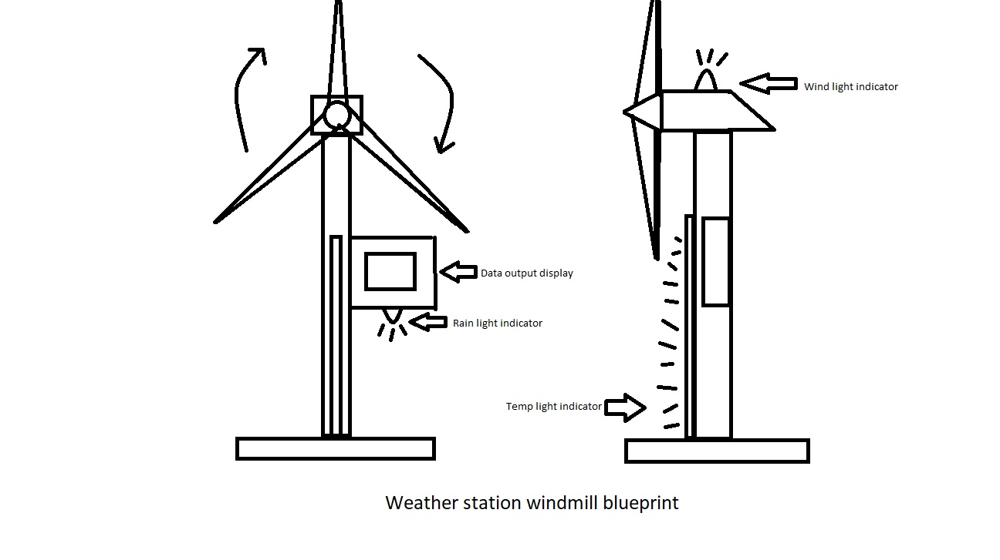
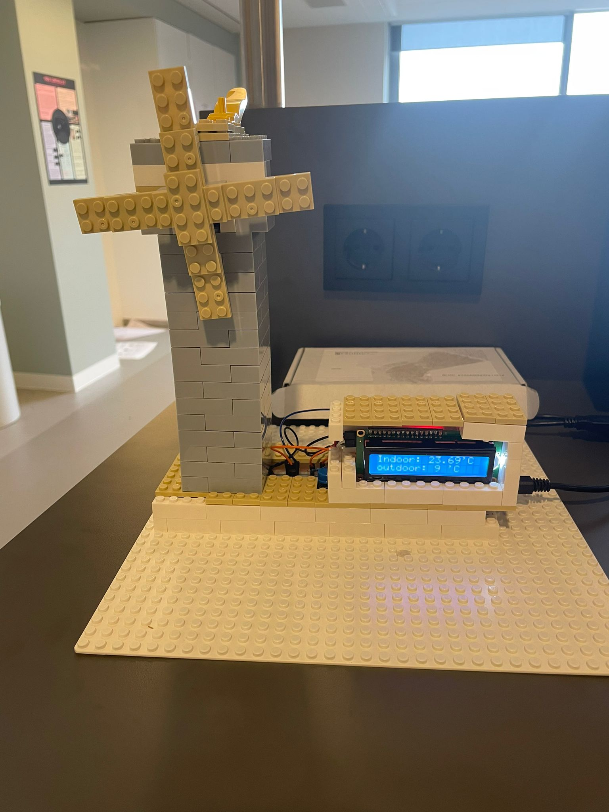
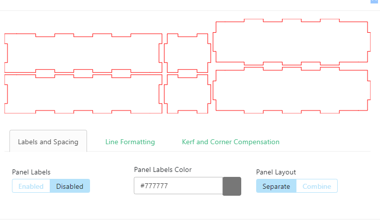
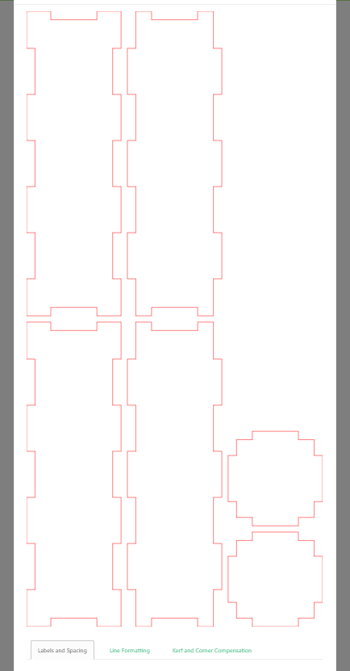
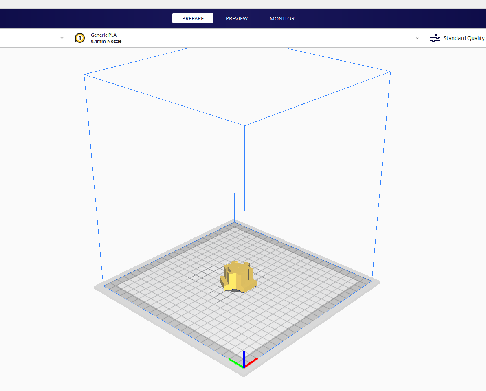
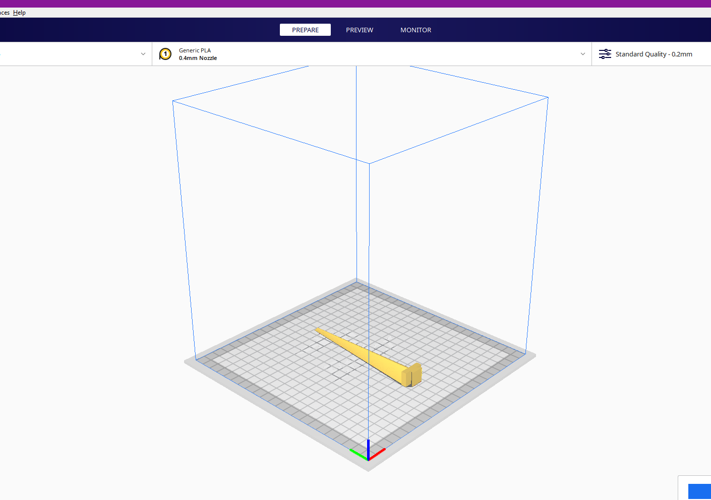

# Physical Design

## Design choices

- Pictures of sketches

- Photo of makeshift prototypes

- Design choices
I wanted a windmill to indicate windspeed outdoor for the users. So I tought it would be creative way for user interaction.
For the rest I like rectangle shapes for the platform and display.
 
## Design

- Pictures of the design files

  
  
  
  
  
- Description of the tools used
  [MakerCase](https://en.makercase.com/#/)
  lasercuter tool to cut wood precisely according to the design.
- [Cura](https://ultimaker.com/nl/software/ultimaker-cura/#/)
  3D print tool to print 3D printed designs. 

## Fabrication

Detailed description of fabrication techniques used

- Wood from 4mm thick casing for the station under platform and pole stand for the windmill. Also casing for the LCD display.
- Foam casing for the motor and 3D printed propellers.

## Fabrication Process

Describe what went well and what went wrong

- What went well was the designing of the box itself also creating holes in the right places were done well with the right measurements. The lasercutting were easy and quick to do sometimes errors, but was easy to fix quick.
- What went wrong was that voor the windmill pole I was trying to use the kerf bent box design, but for some reason I couldn't get the box design. For a certain measurment that I want the design will glitch out of makercase so use the basic box design instead.