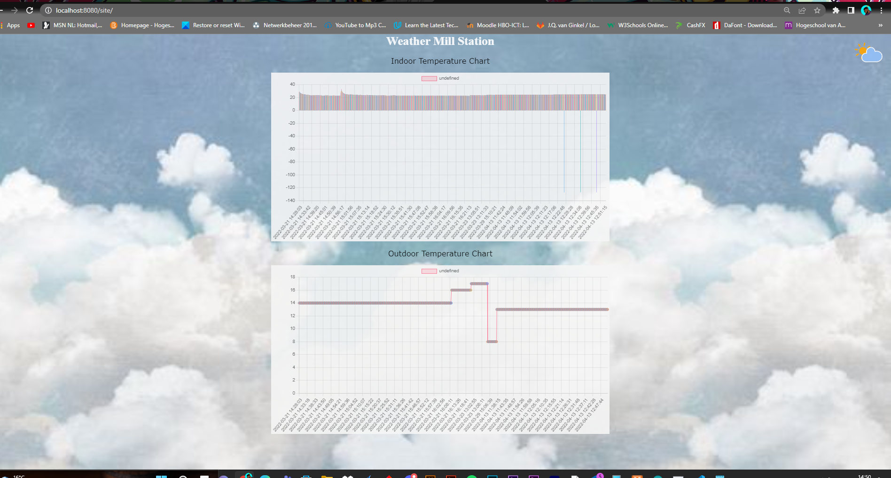

# Web Application

## Description and screenshots
The Weather Mill Station has it is own web-application to show data of the waether. 
The website contains two graphics one for indoor and the other for outdoor.
The graphic of outdoor registers only data that comes from the API that the Wemos provide and for indoor a temperature sensor sends the value to the wemos. 
And registers it on the graphic.



## Back-end technology and database
For the Back-end of the website and database. I have two php files that can insert data to database and fetch data out of the database.
In this file I insert data from the wemos into the database that connect to my server. With this file I can store the specific dat that I want into 
the table of the database and also by rows of the table:

```php
<!-- <?php
$temperature = $_GET["temperature"];
 echo "$temperature";
 $outdoor = $_GET["outdoor"];
 echo "$outdoor";
?> -->

<?php 
$temperature = $_GET["temperature"];
$outdoor = $_GET["outdoor"];


$servername = "localhost";
$username = "iot_stefano";
$password = "QQcRwpEg/AvPTu[r";
$dbname = "iot_webapp";


// Create connection
$conn = new mysqli($servername, $username, $password, $dbname);
// Check connection
if ($conn->connect_error) {
  die("Connection failed: " . $conn->connect_error);
}

$sql = "INSERT INTO temperature (tempVal, outdoor)
VALUES ($temperature, $outdoor)";


if ($conn->query($sql) === TRUE) {
  echo "New record ";

} else {
  echo "Error: " . $sql . "<br>" . $conn->error;
}

$conn->close();
?>
```
In this file I fetch data from the database to later display on the website:

```php
<?php
    $servername = "localhost";
    $username = "iot_stefano";
    $password = "QQcRwpEg/AvPTu[r";
    $dbname = "iot_webapp";

    // Create connection
    $conn = new mysqli($servername, $username, $password, $dbname);
    // Check connection
    if ($conn->connect_error) {
    die("Connection failed: " . $conn->connect_error);
    }

    $sql = "SELECT * FROM `temperature`";
    $result = $conn->query($sql);

    $data = array();
    $temperature = array();
    $outdoor = array();
    $time = array();

    if ($result->num_rows > 0) {
    // output data of each row
        while($row = $result->fetch_assoc()) {
            //echo $row["time"] . " " . $row["tempVal"];
            //$data[] = $row;
            $temperature[] = $row["tempVal"];
            $outdoor[] = $row["outdoor"];
            $time[] = $row["time"];
        }
    } else {
        echo "0 results";
    }
    $conn->close();

    $data["time"] = $time;
    $data["temperature"] = $temperature;
    $data["outdoor"] = $outdoor;
   

    print_r(json_encode($data));
?>
```


## Front-end technology

For the front-end I write it in html,Javascript for the website to display:

```html
<html>
    <head>
        <script src="https://cdn.jsdelivr.net/npm/chart.js@3.7.1/dist/chart.min.js"></script>
        <style type="text/css">
            .chartBox{
                
                display: flex;
                align-items: center;
                justify-content: center;
                margin-left: auto;
                margin-right: auto;
                width: 900px;
                
            }
            
        </style>

    </head>
    <body>
        <style>
            
            body {
                
                background-image: url('https://64.media.tumblr.com/tumblr_mb88akQlJ91r6j7rho1_500.gifv');
                background-size: cover;
                opacity: 0.9;
                height: 100vh;
                padding:0;
                margin:0;
                

            }
            h1 {
                color: white;
                text-align: center;
            }

            p {
                font-family: verdana;
                font-size: 20px;
                text-align: center;
            }    
        </style>
        <style>
            #content {
                position: relative;
            }
            #content img {
                position: absolute;
                top: 0px;
                right: 0px;
            }
        </style>
        
        <div id="content">
            
        </div>
        <h1>Weather Mill Station</h1>
        <p>Indoor Temperature Chart</p>
        
        
        
        <div class="chartBox">
            <canvas id="myChart"></canvas>
        </div>
        <p>Outdoor Temperature Chart</p>
        <div class="chartBox">
            <canvas id="myChart2"></canvas>
        </div>
        
        <script>
        const ctx = document.getElementById('myChart').getContext('2d');
        const ctx2 = document.getElementById('myChart2').getContext('2d');
        let myChart,myChart2;
        

        fetch('http://localhost:8080/site/get_db.php')
            .then(response => response.json())
            .then(data => createChart(data));

        setInterval(function () {
            fetch('http://localhost:8080/site/get_db.php')
            .then(response => response.json())
            .then(data => {
                updateChart(myChart, data)
                updateChart2(myChart2, data)

            }); 
              
        }, 10000);

        function updateChart(chart, data){
            chart.data.labels= data.time;
            chart.data.datasets[0].data = data.temperature;
            chart.update();

        }
        function updateChart2(chart, data){
            chart.data.labels= data.time;
            chart.data.datasets[0].data = data.outdoor;
            chart.update();

        }
        function createChart(data){
            myChart = new Chart(ctx, {
                type: 'bar',
                data: {
                    
                    
                    labels: data.time, 
                    
                    datasets: [{
                        backgroundColor: [
                            'rgba(255, 99, 132, 0.2)',
                            'rgba(54, 162, 235, 0.2)',
                            'rgba(255, 206, 86, 0.2)',
                            'rgba(75, 192, 192, 0.2)',
                            'rgba(153, 102, 255, 0.2)',
                            'rgba(255, 159, 64, 0.2)'
                        ],
                        borderColor: [
                            'rgba(255, 99, 132, 1)',
                            'rgba(54, 162, 235, 1)',
                            'rgba(255, 206, 86, 1)',
                            'rgba(75, 192, 192, 1)',
                            'rgba(153, 102, 255, 1)',
                            'rgba(255, 159, 64, 1)'
                        ],
                        
                        data: data.temperature,
                        borderWidth: 1
                    }]
                },
                options: {
                    
                    maintainAspectRatio: true,
                    Animation: false,
                    scales: {
                        y: {
                            
                            beginAtZero: true
                        }
                    }
                }
            });

            myChart2 = new Chart(ctx2, {
                type: 'line',
                data: {
                    
                    
                    labels: data.time, 
                    
                    datasets: [{
                        backgroundColor: [
                            'rgba(255, 99, 132, 0.2)',
                            'rgba(54, 162, 235, 0.2)',
                            'rgba(255, 206, 86, 0.2)',
                            'rgba(75, 192, 192, 0.2)',
                            'rgba(153, 102, 255, 0.2)',
                            'rgba(255, 159, 64, 0.2)'
                        ],
                        borderColor: [
                            'rgba(255, 99, 132, 1)',
                            'rgba(54, 162, 235, 1)',
                            'rgba(255, 206, 86, 1)',
                            'rgba(75, 192, 192, 1)',
                            'rgba(153, 102, 255, 1)',
                            'rgba(255, 159, 64, 1)'
                        ],
                        
                        data: data.outdoor,
                        borderWidth: 1
                    }]
                },
                options: {
                    
                    maintainAspectRatio: true,
                    Animation: false,
                    scales: {
                        y: {
                            
                            beginAtZero: true
                        }
                    }
                }
            });
        }
        </script>

    </body>
</html>

```

## 3rd party API

Used API-endpoint


Only the current weather data in the compact parameter:

```
GET http://api.iot.hva-robots.nl/weather/Amsterdam/compact
```

Sample response:

```
{
  "success": true,
  "data": {
    "FeelsLikeC": "11",
    "FeelsLikeF": "53",
    "cloudcover": "25",
    "humidity": "94",
    "localObsDateTime": "2021-09-22 08:53 AM",
    "observation_time": "06:53 AM",
    "precipInches": "0.0",
    "precipMM": "0.0",
    "pressure": "1028",
    "pressureInches": "30",
    "temp_C": "12",
    "temp_F": "54",
    "uvIndex": "1",
    "visibility": "9",
    "visibilityMiles": "5",
    "weatherCode": "116",
    "weatherDesc": [
      {
        "value": "Partly cloudy"
      }
    ],
    "weatherIconUrl": [
      {
        "value": ""
      }
    ],
    "winddir16Point": "SW",
    "winddirDegree": "220",
    "windspeedKmph": "15",
    "windspeedMiles": "9"
  }
}
```

The request of data is the equivalent to a regular call to create a post above:

| Field | Type   | Description                                                                                                    |
|:-----:|:------:| --------------------------------------------------------------------------------------------------------------:|
| API   | string | sends a formated string value between interfaces, values that are measurement of outdoor sensor of the weather |

The rules around publishing each request to this API must respect:

- This API is only use for creative goals and not for the purpose of making money.
- If the user is neither a writer nor an editor, the user is not allowed to create any posts in a publication.
- Don't use verbs in urls.

Possible Http code:

| Http code              | Description                                                                                                                                   |
|:----------------------:| ---------------------------------------------------------------------------------------------------------------------------------------------:|
| 307 Temporary Redirect | redirect status response code indicates that the resource requested has been temporarily moved to the URL given by the `Location` headers.    |
| 200 OK                 | success status response code indicates that the request has succeeded.                                                                        |
| 400 Bad Request        | response status code indicates that the server cannot or will not process the request due to something that is perceived to be a client error |

