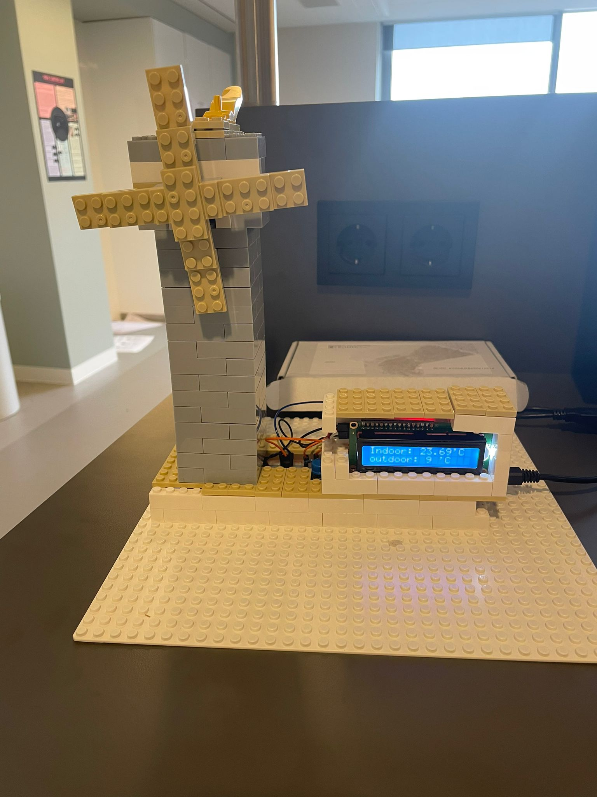

## The Weather Mill Station

The weather mill station a device that will show you the outdoor temperature and the indoor temperature. 
The station can indicate wind power by spinning the mill depending on the wind speed outside. 
The station LCD can display more data of the weather with a push of a button. The weather mill station is meant to reduce the use of a smartphone. 
If the user wants to track the weather data. The web application of the weather mill station will show a graphic of the indoor/outdoor temperature history. 

